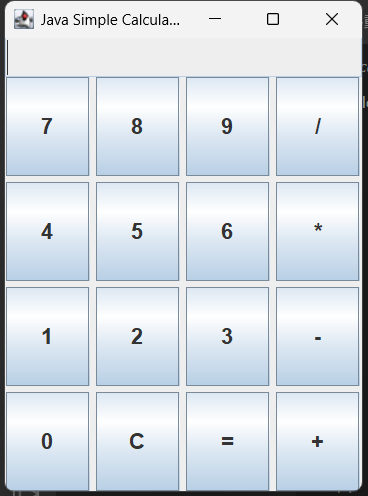

# Javaデスクトップ電卓 & Webポートフォリオ


Javaで開発したデスクトップ向け電卓アプリケーションと、その動作ロジックをWeb上で再現したポートフォリオサイトを統合したプロジェクトです。

## 🚀 動作デモ (GitHub Pages)
ブラウザ上でJavaScriptによる動作デモを確認いただけます：
[https://kotajobs0.github.io/Calculator/](https://kotajobs0.github.io/Calculator/)

## 🛠 使用技術
- **プログラミング言語:** Java (JDK)
- **フロントエンド:** HTML5, CSS3, JavaScript (ES6)
- **バージョン管理・公開:** Git, GitHub, GitHub Pages

## ✨ 工夫した点
### 1. 堅牢な計算ロジック (Java / JavaScript)
- **四則演算の実装:** 演算子の優先順位を考慮したロジックを構築しました。
- **例外処理の徹底:** 「0での割り算」など、エラーの原因となる入力に対する例外処理（バリデーション）を実装し、アプリの強制終了を防いでいます。

### 2. モダンなWeb制作
- **レスポンシブ対応:** `viewport`メタタグを適切に設定し、PC・タブレット・スマートフォンのあらゆるデバイスで最適なレイアウトが表示されるように調整しました。
- **クリーンなコーディング:** エディタの警告（インラインスタイルの回避など）を解消し、構造（HTML）とデザイン（CSS）を分離した保守性の高いコードを記述しました。

### 3. JavaからWebへのロジック移植
- Javaで作成したバックエンドの計算アルゴリズムをJavaScriptへ移植し、デスクトップアプリとWebデモで一貫した挙動を実現しました。

## 📂 ファイル構成
- `index.html`: ポートフォリオのメインページ（HTML/CSS/JS）
- `Calculator.java`: 電卓のメインロジックを含むJavaソースコード
- `Calculator.png`: アプリケーションの実行画面スクリーンショット
- `README.md`: 本ドキュメント

## 📝 実行方法（Java版）
1. 本リポジトリをクローンまたはダウンロードします。
2. 以下のコマンドでコンパイルおよび実行が可能です。
   ```bash
   javac Calculator.java
   java Calculator
